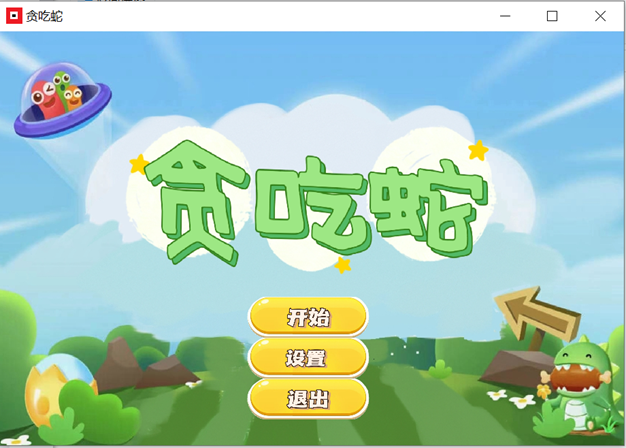
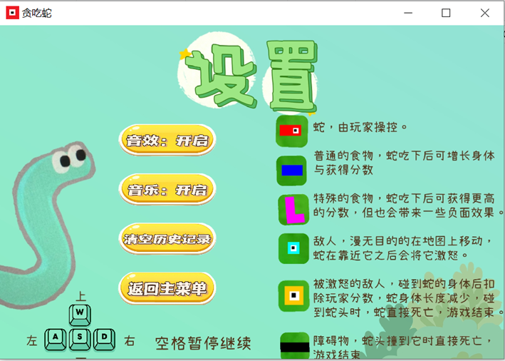
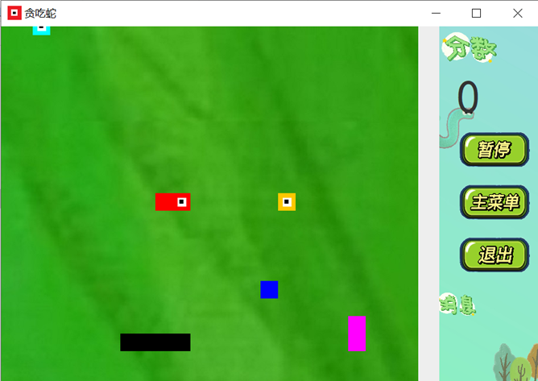
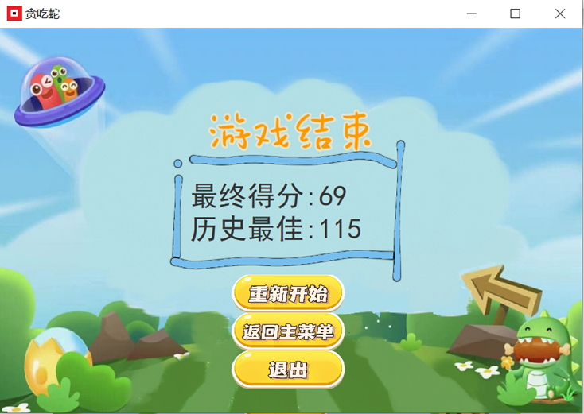

## 项目简介
基于Java Swing的贪吃蛇游戏

Java面向对象程序设计课堂作业

开发时间：2023/04/18-2023/05/20

上传时间：2025/07/08
## 项目结构
##### .idea
存放idea管理项目的配置文件
##### META-INF
用于配置，指定Jar包中的运行类
##### Resource
运行程序所需的图片、音频文件
- Pictures：图片文件
- Sounds：声音文件
- Save：存档，储存历史分数
- Screenshot：游戏截图
##### src
存放Java源代码
- entity：存放游戏中的实体类，如蛇(Snake)、食物(Food)、障碍物(Block)
- game：存放游戏应用程序的配置、逻辑
- util：存放游戏工具，如分数(Score)、排行(RankList)
###### SnakeGame.jar
项目打包成的jar包，可直接运行
## 运行
#### 直接运行
在idea中打开此项目，运行src/Game.java中的main方法
#### 运行jar包
安装jdk，在项目中打开Cmd，输入以下命令运行程序

也可在idea中打开此项目的此文件(README.md)，点击下方命令左侧绿色箭头快速运行
```bash
java -jar SnakeGame.jar
```
运行程序时需要将SnakeGame.jar与Resource文件夹放在一起
## 游戏规则
玩家操控贪吃蛇吃食物来获得分数，同时要躲避敌人和障碍物
- 移动：通过WASD控制
- 地图：相较于一般的贪吃蛇游戏，本游戏地图更大，玩家视角会随着蛇头移动
- 食物：有两种食物，分别有以下效果，随机抽取
  - 蓝色食物
    - 分数+1,长度+1,敌人数量-1
    - 分数+1,长度+2
    - 分数+2,长度+1
    - 分数+1,长度+1
  - 紫色食物：可能带来负面效果
    - 分数+4,敌人数量+1
    - 分数+3,长度-1
    - 分数+3,敌人侦察范围+1
    - 分数+2
- 障碍：地图里的黑色方块，蛇头撞上则游戏结束
- 敌人
  - 蛇头不在敌人的视野范围内时，敌人为天蓝色，会在地图上随意移动
  - 当蛇头进入敌人的视野范围之内，敌人变为暴怒状态，会追击玩家，此时敌人的颜色会变为黄色
  - 被攻击到身体时玩家分数-1，长度-1；被攻击到头部时游戏结束
  - 游戏开始只有4个敌人，且每分钟敌人数量+1。
##### 设置
在设置界面里可以选择是否开启游戏的音效、背景音乐，以及清空历史记录，也可以查看游戏规则。
## 运行截图
主界面



设置页面



游戏页面



结算页面


